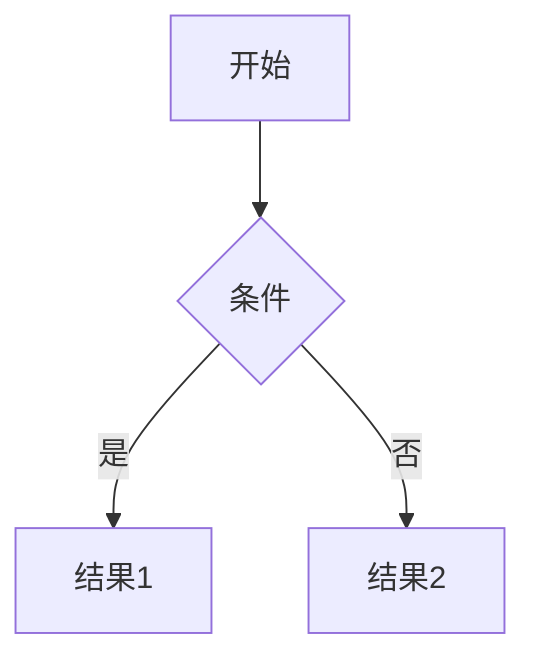

# 外汇交易

# <center><font face="黑体" color=balck size= 19>MarkDown 入门教程</font><center>
## <center><font face="楷体">指北针</font></center>

# 基本语法
>#一级标题  
>##二级标题  
>###三级标题  

## 文本样式
 
>段落换行需要两个空格结尾/也可以按shift+enter

粗体： **文本** 
斜体： *文本*  
粗斜体： ***文本***  
删除线： ~~文本~~  
下划线： <u>文本</u>  
高亮： ==文本==

## 列表与区块

### 无序列表
>输入*或者-或者+  +空格
* 一节分类
  - 二级分类 按tab键
    + 三级分类 按tab键
  
- ctrl+tab 来升降等级

### 有序列表
>数字 +.+空格  
1. 第一个
2. 第二个
   1. 同上按tab降级
   2. 可进行列表嵌套，前面空四格


### 任务列表todolist
>同一级别

* [x] a
+ [ ] b
- [ ] c


### 区块显示
>时代

>链接可以直接放 按crtl键进入

https://wx.mail.qq.com/list/readtemplate?name=login_jump.html&qm_sid=wb4dyw-I9VMkOW0L&type=session_timeout&sid=undefined


## 代码与表格

### 代码
>行内代码：

`print("hello,world");`

>代码块：
````python
def hello():
    print("world")
````


### 表格
---       
|左对齐  |居中对齐  |右对齐  |
|:------|:-------:|-------:|
|一带一路 |丝绸之路经济带 |海上丝绸之路|


---
>换行2个空格，---，shift+enter

## 数学公式

>行内公式

$E=mc^2$

>块公式

$$
\begin{Bmatrix}  
    a&b\\  
    c&d  
\end{Bmatrix}
$$


## 图标绘制
<div align="center">


</div>

## 图片与链接
- 使用图床保存图片并实现插入
  [路过图床]：https://imgse.com/

- 使用markdown语法插入
[](https://www.superbed.cc/timeline)


- 使用html语言实现调整图片大小和位置功能
<!-- 调整图片大小 -->
<div  align=center ></div>


**使用技巧**
- ctrl + b ：快速加粗  
- ctrl + i : 快速斜体  
- tab: 列表缩进


**导出pdf**

- 转义字符： \*  显示星号  
- html标签： <br>强制换行

**跳转语法**
- [click](#一级标题)

### 脚注

- hello[^1]
- world[^2]


[^1]:to greet
[^2]:global area


